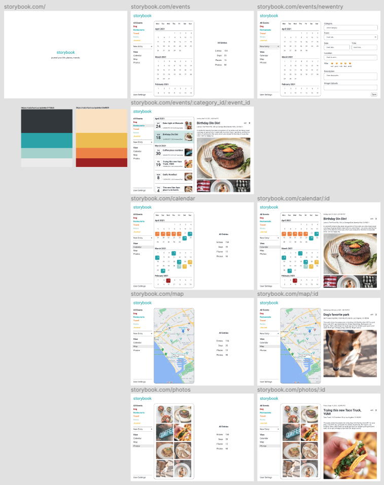
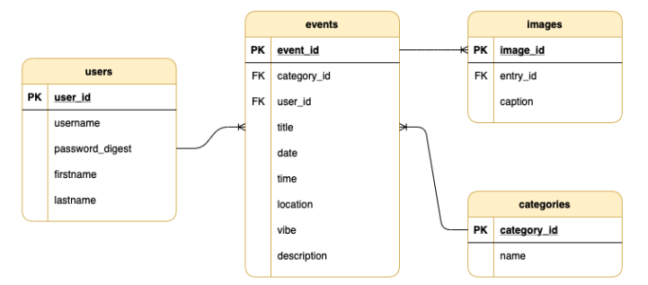
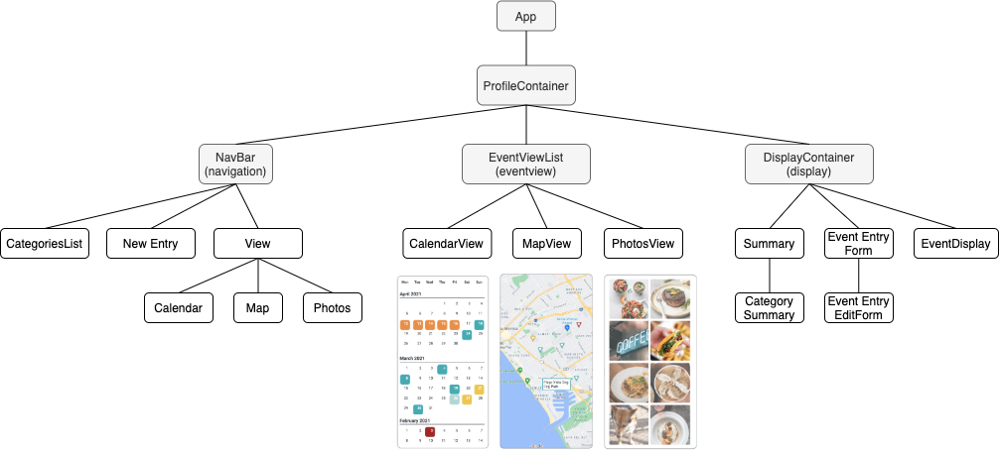
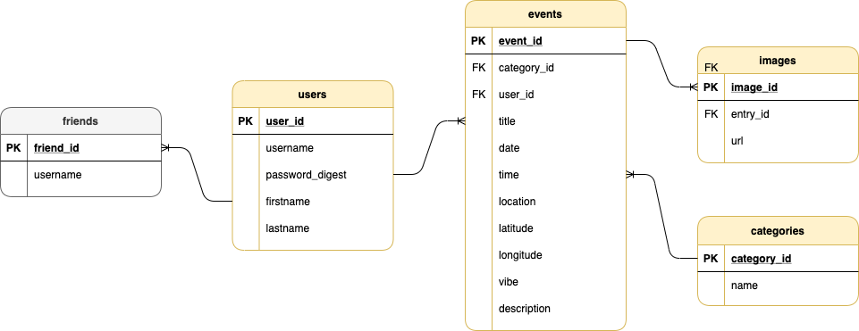

# Storybook

<div align="center">
  
</div>

<br>

<strong>Domain Modeling :: Digital Journaling</strong><br>
Welcome to my simplistic version of digital journaling app.<br>

<p><a href="https://github.com/fentybit/Storybook_backend">Back-End GitHub Repo</a></p>
<p><a href="https://youtu.be/vlcJ1QT3M_M">YouTube Demo</a></p>
<p><a href="https://dev.to/fentybit/storybook-4p2g">DEV Blog</a></p>

## About

<p>I have been a long-advocate for having meaningful connection through self-reflection. While some journal apps I have seen simply record special memories and events, some focus more on mental health, mindfulness and self-care. I have decided to approach this app build with basic features of recorded events and necessary attributes. </p>
<p>The Minimum Viable Product (MVP) of Storybook app is to allow the user to log events, places, moods and self-reflect from various points of views (calendar, map, photos).</p>

## Features

<div align="center">
  
</div>

<br>

<div align="center">
  
</div>

<br>

<div align="center">
  
</div>

<br>

**Models** <br>
User, Event, Category, Image<br>

> user `has_many` :events

> event `belongs_to` :user<br>
> event `belongs_to` :category<br>
> event `has_many` :images

> category `has_many` :events

> image `belongs_to` :event

**Controller** <br>
ApplicationController<br>
Api::V1::AuthController<br>
Api::V1::CategoriesController<br>
Api::V1::EventsController<br>
Api::V1::ImagesController<br>
Api::V1::UsersController<br>

**User Account and Validation** <br>
JWT Authentication: Sign Up, Log In and Log Out.<br>

## API Database

- [x] <a href="https://console.cloud.google.com/apis/dashboard">Google Developer API</a>
- [x] <a href="https://cloudinary.com/">Cloudinary API</a>

## Installation

<strong>Back-End</strong>

```ruby
$ git clone 👾
$ bundle install
$ rails db:create && db:migrate
$ rails db:seed
$ rails s
```

<strong>Front-End</strong>

<p>Open Chrome browser, and redirect to a new local host to start the app.</p>

**Alternatively, it is fully deployed on Netlify!**
<br>
<a href="https://your-storybook.netlify.app">Storybook</a>

## Build Status and Future Improvement

<p>Storybook was completed in a 2-week timeframe from implementing Rails back-end, ReactJS front-end, Cloudinary API, Google Maps API and Material-UI library. Future cycle of product development as follows:</p>

- [x] Search Bar. Over the time, the user will have many events, and it gets troublesome when the user needs to immediately access a specific event entry. A search bar to quickly type event title and access the journal entry would be useful.
- [x] Add `Friend` to model associations. I envision my app to emulate similar concept such as Instagram. Instead of creating a simple journaling app, what about a social journaling platform. Each user can personalize their privacy whether or not they'd like to share with their friends.

<div align="center">
  
</div>

- [x] Adding mood tracker. Current attribute `vibe` to capture my preliminary attempt of gathering user mood data on each event entry. I found a [mood tracker API](https://github.com/drypycode/MoodTracker-API) that I would love to integrate in future project build. User can view their journal entries based on `Mood` under View NavBar.
- [x] Current event entry only allows one image upload. User should be able to upload multiple images, insert GIF and video upload.
- [x] Create a toggle track for dark mode. 😎

## Stack

- [x] Active Record
- [x] Bcrypt
- [x] PostgreSQL
- [x] ActiveModel::Serializer
- [x] Rack CORS
- [x] React Router
- [x] React Infinite Calendar
- [x] Google Map React
- [x] React Places Autocomplete
- [x] Cloudinary
- [x] Material-UI

## Resources

- [x] <a href="https://reactjs.org/">ReactJS</a>
- [x] <a href="https://cloudinary.com/">Cloudinary</a>
- [x] <a href="https://www.npmjs.com/package/google-maps-react">Google Maps React</a>
- [x] <a href="https://www.npmjs.com/package/react-google-autocomplete">React Google Autocomplete</a>
- [x] <a href="https://github.com/clauderic/react-infinite-calendar">React Infinite Calendar</a>
- [x] <a href="https://material-ui.com/">Material-UI</a>
- [x] <a href="https://unsplash.com/">Unsplash</a>
