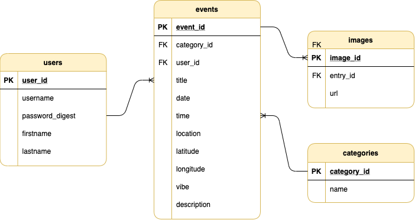

# Storybook

<div align="center">
  
</div>

<br>

<strong>Domain Modeling :: Digital Journaling</strong><br>
Welcome to my simplistic version of digital journaling app.<br>

<p><a href="#">YouTube Demo</a></p>
<p><a href="#">DEV Blog</a></p>

## About

<p>I have been a long-advocate for having meaningful connection through self-reflection. While some journal apps I have seen simply record special memories and events, some focus more on mental health, mindfulness and self-care. I have decided to approach this app build with basic features of recorded events and necessary attributes. </p>
<p>The Minimum Viable Product (MVP) of Storybook app is to allow the user to log events, places, moods and self-reflect from various points of views (calendar, map, photos).</p>

## Features

<div align="center">
  
</div>

<br>

<div align="center">
  
</div>

<br>

**Models** <br>
User, Event, Category, Image<br>

> user `has_many` :events

> event `belongs_to` :user<br>
> event `belongs_to` :category<br>
> event `has_many` :images

> category `has_many` :events

> image `belongs_to` :event

**Controller** <br>
ApplicationController<br>
UsersController<br>
EventsController<br>
CategoriesController<br>
ImagesController<br>

**User Account and Validation** <br>
JWT Authentication: Log In, Log Out, Sign Up.<br>

## API Database

- [x] <a href="https://developers.google.com/maps/documentation/javascript/places-autocomplete">Google Maps JavaScript API</a>

## Installation

<strong>Back-End</strong>

```ruby
$ git clone 👾
$ bundle install
$ rails db:create && db:migrate
$ rails db:seed
$ rails s
```

<strong>Front-End</strong>

<p>Open Chrome browser, and redirect to a new local host to start the app.</p>

Open Chrome browser, and redirect to 'http://localhost:3000' to start the app.

**Alternatively, it is fully deployed on Heroku!**
<br>
<a href="#">Storybook</a>

## Build Status and Future Improvement

<p>Current project-built was completed in a 2-week timeframe from model association development, MVP for user interface and Material UI implementation. Future cycle of product development as follows:</p>

- [x]
- [x]
- [x]
- [x]
- [x]
- [x]

## Stack

- [x] Active Record
- [x] Bcrypt
- [x] PostgreSQL
- [x] ActiveModel::Serializer
- [x] React Router
- [x] React Calendar
- [x] Google Map React
- [x] React Places Autocomplete
- [x] Material-UI

## Resources

- [x] <a href="https://www.npmjs.com/package/react-calendar">React Calendar</a>
- [x] <a href="https://material-ui.com/">Material-UI</a>
